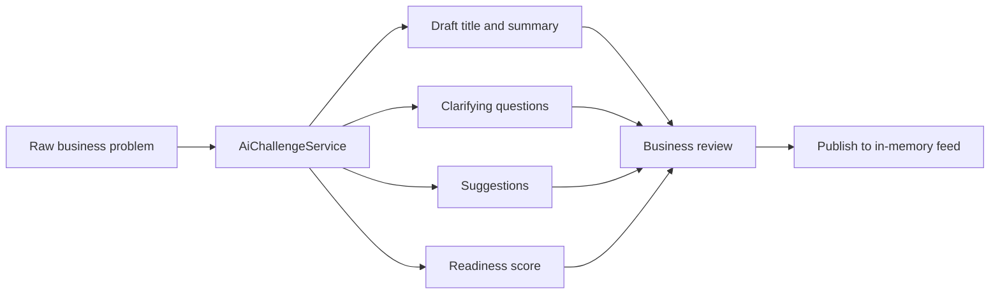
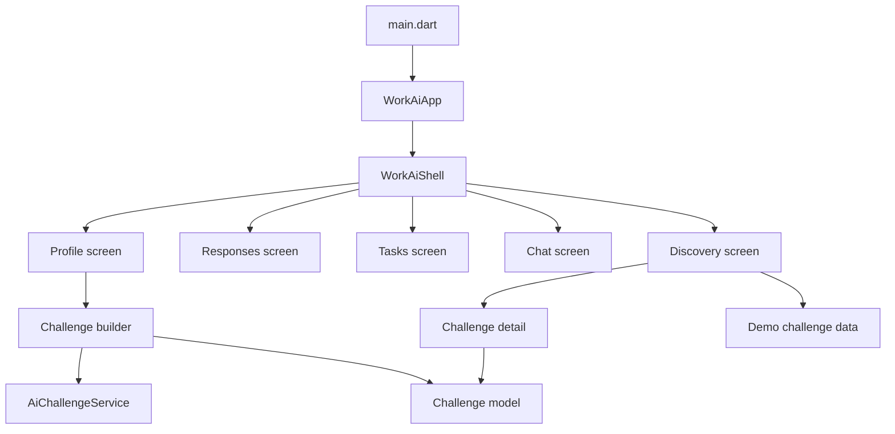

# SANA

> **Turn an ambiguous business problem into a clear challenge students can solve.**

[](https://flutter.dev) [](https://dart.dev) [](android/) [](web/)

**SANA** is a student–business collaboration concept built for the AI SANA practical hackathon case. The current Flutter prototype is branded **Work.ai** in the interface and demonstrates the core exchange: a business turns a raw problem into a publishable challenge, while a student discovers the brief, applies, and follows the work from one workspace.

[Open the repository](https://github.com/BAITC-Hacks/hack-3228a77c-it-forge)

## Why SANA

Businesses often have useful problems but not a ready-to-share brief. Students have skills and motivation but lack access to concrete, paid, real-world challenges. SANA makes the handoff tangible:

| For businesses | For students |
| --- | --- |
| Start with a plain-language operational problem. | Browse a focused marketplace of business challenges. |
| Use guided questions to make the brief clearer. | Open a complete brief with context, skills, reward, and AI match score. |
| Publish the challenge to the discovery feed. | Apply, track work, and continue the conversation in one demo workspace. |

The product is intentionally built around a visible challenge lifecycle rather than a generic job board: **problem → clarification → ready-to-publish challenge → student response → workspace**.

## What is implemented

- A responsive challenge discovery feed with search, category filters, cards, match scores, tags, and reward ranges.
- A detail view containing challenge context, deliverables, data/skills sections, favorite state, and an application action.
- Student and business profile modes in the same app shell.
- A business challenge builder that turns a raw problem into a structured draft, clarification questions, suggestions, and a readiness score before publishing.
- Publishing into the in-memory discovery feed during the current app session.
- Student responses, task-progress, and chat screens for the end-to-end prototype flow.
- Compact mobile navigation and a `NavigationRail` layout on wide screens.

There are no product screenshots committed to this repository yet, so this README deliberately does not include placeholder imagery.

## AI-assisted challenge builder

The app contains a small, transparent AI-shaped layer at [`lib/core/services/ai_challenge_service.dart`](lib/core/services/ai_challenge_service.dart). It is a deterministic local demo fallback—not a connection to Gemini, OpenAI, or another external model.



The service waits briefly to model an analysis step, then returns a fixed draft structure based only on the supplied text and answer completion. The score begins at **12** for a short/empty problem or **32** for a problem longer than 35 characters, gains **14** for each non-empty clarification answer, and is capped at **91**. This makes the interaction predictable and easy to demo, but it is **not** a production AI evaluation or the weighted readiness model proposed for a future release.

No API key, environment variable, or network configuration is needed to run the Flutter prototype. The `deisgnappwai/` directory is a separate reference project and is not used by the Flutter runtime.

## Architecture

The project uses Flutter's built-in widget and state primitives. State is held in screen/app state with `StatefulWidget` and `setState`; sample challenges live in source code and changes last only for the current session.



```text
lib/
├── app/
│   ├── theme/                 # Colors and ThemeData
│   └── work_ai_app.dart       # App shell, navigation, session state
├── core/services/
│   └── ai_challenge_service.dart
├── features/
│   ├── challenges/            # Builder and detail screens
│   ├── home/                  # Discovery feed
│   └── workspace/             # Responses, tasks, chat, profile
├── shared/
│   ├── data/                  # Seed challenge data
│   ├── models/                # Challenge and AI draft models
│   └── widgets/               # Reusable UI components
└── main.dart

test/widget_test.dart          # Widget smoke test for the discovery feed
android/                       # Android host project
web/                           # Web host project
```

## Tech stack

| Layer | Current implementation |
| --- | --- |
| UI | Flutter Material widgets, custom theme, responsive layout |
| Language | Dart (`^3.11.4`) |
| State | Local `StatefulWidget` / `setState` |
| AI flow | Deterministic local `AiChallengeService` demo fallback |
| Data | In-memory model and seed data in `lib/shared/data/demo_data.dart` |
| Testing | `flutter_test` and `flutter_lints` |
| Targets | Android and Flutter web host projects |

There is currently no authentication service, database, REST/GraphQL API, analytics provider, cloud storage, or production LLM integration in the Flutter app.

## Quick start

### Prerequisites

- A Flutter SDK compatible with Dart `^3.11.4`
- For Android: Android Studio/SDK and either an emulator or a USB-debuggable device
- For web: Chrome or another Flutter-supported browser

```bash
git clone https://github.com/BAITC-Hacks/hack-3228a77c-it-forge.git
cd hack-3228a77c-it-forge
flutter pub get
```

Run on Android:

```bash
flutter devices
flutter run -d <android-device-id>
```

Run in Chrome:

```bash
flutter run -d chrome
```

Validate the project:

```bash
flutter analyze
flutter test
```

## Deterministic verification scenario

Use this flow to verify the main interaction without relying on a backend or an external AI provider:

1. Open **Profile** and switch to **business mode**.
2. Choose **New business challenge**.
3. Keep or replace the problem text, then start the AI analysis.
4. Answer one or more clarification questions and run the analysis again; the readiness score changes predictably.
5. Publish the draft. The new challenge is added to the discovery feed for the active session.
6. Switch back to **student mode**, open a challenge from discovery, and apply.
7. The app moves to the responses workspace; open **Chat** and send a local message to confirm the interactive UI path.

The responses, task progress, and initial chat messages are demo content. They illustrate the product flow but do not persist or synchronize with a server.

## 2-minute demo script

**0:00–0:20 — The problem.** “A business may know it is losing time or money, but it rarely arrives with a structured challenge a student can confidently solve.” Show the discovery feed.

**0:20–0:55 — Clarify, do not fabricate.** Switch to business mode and open the challenge builder. Enter the raw problem, start the analysis, and answer the generated questions. Point out that the prototype surfaces structure, questions, suggestions, and a readiness signal without claiming hidden facts.

**0:55–1:15 — Publish.** Publish the reviewed challenge and return to discovery to show that it is immediately visible in the current session.

**1:15–1:40 — Student action.** Switch to student mode, open a challenge, inspect its context and skill tags, and apply.

**1:40–2:00 — One workspace.** Show the responses, task progress, and chat tabs. Close with: “SANA turns a vague business need into a visible student opportunity and a shared delivery flow.”

## Current limitations

- All data and state are in memory; publishing, chat messages, and UI state reset on restart.
- The AI service is deterministic demo logic, not an LLM or evidence-grounded readiness evaluator.
- Challenge editing fields are visual in the builder; edits are not written back to the published model.
- Authentication, roles, real company/student profiles, notifications, payments/escrow, and persistence are not implemented.
- Responses and task progress are illustrative seed content, not a live business decision workflow.
- Android uses the current example application ID (`com.example.wai`) and the release build configuration still uses debug signing. These must be replaced before a store release.

## Roadmap

1. Replace the local demo service with a secure, source-grounded AI workflow and explainable readiness criteria.
2. Persist users, challenges, applications, messages, and delivery milestones with role-based access.
3. Add real review actions for businesses, student portfolios, attachments, and transparent status changes.
4. Add notifications, escrow/payment milestones, audit history, and privacy controls.
5. Polish localization, accessibility, analytics, and production Android/web deployment configuration.

## Contributing

This is a hackathon prototype. If you extend it, keep product claims traceable to the implementation, avoid adding user facts during AI-assisted drafting, and add tests for each new workflow.

---

Built for the **AI SANA** practical hackathon case. Current prototype interface: **Work.ai**.
